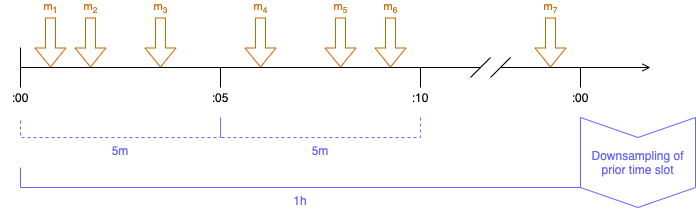
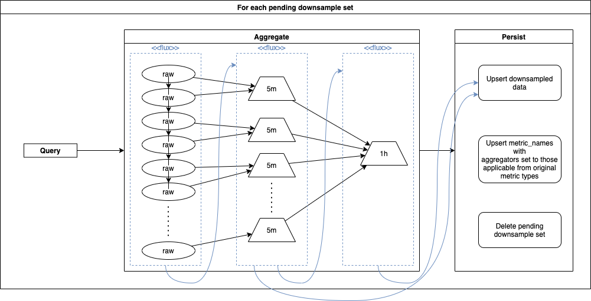

## Design

### Tables

The Cassandra tables in the `tsdb` keyspace (by default) are organized into two categories:
- **metadata** : tables that enable metadata lookup directly or to enable queries
- **data** : tables that store the timestamped values

#### Metadata

`metric_names`:

&nbsp; | Name | Notes
---|---|---
PK | tenant |
CK | metric_name | 
&nbsp; | aggregators | `set<text>` of one or more of raw,min,max,sum,count,avg

`series_sets`:

&nbsp; | Name | Notes
---|---|---
PK | tenant |
PK | metric_name | 
CK | tag_key |
CK | tag_value |
CK | series_set | As `{metric_name},{tagK}={tagV},...` with tagK sorted

#### Data

`data_raw`:

&nbsp; | Name | Notes
---|---|---
PK | tenant |
PK | series_set | As `{metric_name},{tagK}={tagV},...` with tagK sorted
CK | ts | timestamp of ingested metric
&nbsp; | value | Metric value as double

To be a bit more explicit, all these tables are updated/inserted on ingest.  The "metric_names" table is during metadata queries for tenants and metric names. Metadata queries for tag keys and values given tenant and metric name are resolved by the "series_sets" table. The "series_set" and "data_raw" tables are used in combination by data queries and "data_raw" is also used during downsampling.

### Series-Set

Each series is identified by a "series-set" which is a compact, textual, stable representation of a series.

The syntax is:
```
{metric_name},{tag_key}={tag_value},{tag_key}={tag_value},...
```

where the tag key-value pairs are sorted by tag key to ensure a stable and deterministic structure.

The `series_sets` table is effectively an index of each `tag_key`-`tag_value` pair to the one or more series sets that contain that tag pair.

### Ingest

When ingesting a metric, the following actions occur:
1. A series-set is computed from the metric name and tags, [as described above](#series-set)
2. The data value itself is inserted
3. The metadata of the metric series is "upserted". 
   - Cassandra doesn't have first-class support for upserts; however, the metadata tables consist entirely of primary key columns and a CQL `INSERT` differs from SQL in that it will ensure "the row is created if none existed before, and updated otherwise"
   - Four tables are involved in the metadata upsert in order to accommodate the denormalized/NoSQL nature of Cassandra and enable metadata retrieval by each facet
   - Since ingest works with raw metrics, the `raw` column, and only that column, of `metric_names` will be updated to a value `true`

### Data Query

The goal of a data query is to provide the data for the requested tenant, metric name, and one or more tags whose timestamped values fall within the requested time range

Such a query is performed in two steps:
- query the series_set table to retrieve the metadata for the requested tenant, metric name, and tags 
- use that metadata to query the data_raw table to retrieve the values that fall within the requested time range

The first step is achieved by retrieving the list of series-sets for each request tag (key-value). For example, let's say the query is requesting the metric `cpu_idle` and results for the tags `os=linux` and `deployment=prod`. A metadata retrieval of series-sets for each tag would be:

For `os=linux`:

| tenant | metric\_name | tag\_key | tag\_value | series\_set |
| :--- | :--- | :--- | :--- | :--- |
| t-1 | cpu\_idle | os | linux | cpu\_idle,deployment=dev,host=h-3,os=linux |
| t-1 | cpu\_idle | os | linux | cpu\_idle,deployment=prod,host=h-1,os=linux |
| t-1 | cpu\_idle | os | linux | cpu\_idle,deployment=prod,host=h-4,os=linux |

For `deployment=prod`:

| tenant | metric\_name | tag\_key | tag\_value | series\_set |
| :--- | :--- | :--- | :--- | :--- |
| t-1 | cpu\_idle | deployment | prod | cpu\_idle,deployment=prod,host=h-1,os=linux |
| t-1 | cpu\_idle | deployment | prod | cpu\_idle,deployment=prod,host=h-2,os=windows |
| t-1 | cpu\_idle | deployment | prod | cpu\_idle,deployment=prod,host=h-4,os=linux |

The series-sets to retrieve from the data table can then be computed by finding the intersection of `series_set` from all of the tag retrievals. With the example above, that intersection would be:

- `cpu_idle,deployment=prod,host=h-1,os=linux`
- `cpu_idle,deployment=prod,host=h-4,os=linux`

The second step of the query is achieved by iterating over each series-set and querying the data table by tenant, series-set, and the requested time-range. Continuing the example, those rows from `data_raw` would be:

| tenant | series\_set | ts | value |
| :--- | :--- | :--- | :--- |
| t-1 | cpu\_idle,deployment=prod,host=h-4,os=linux | 2020-08-24 16:34:05.000 | 477 |
| t-1 | cpu\_idle,deployment=prod,host=h-1,os=linux | 2020-08-24 15:51:15.000 | 186 |
| t-1 | cpu\_idle,deployment=prod,host=h-1,os=linux | 2020-08-24 16:23:54.000 | 828 |
| t-1 | cpu\_idle,deployment=prod,host=h-1,os=linux | 2020-08-24 16:23:58.000 | 842 |
| t-1 | cpu\_idle,deployment=prod,host=h-1,os=linux | 2020-08-24 16:26:52.000 | 832 |
| t-1 | cpu\_idle,deployment=prod,host=h-1,os=linux | 2020-08-24 16:34:05.000 | 436 |

The resulting JSON structure derives the metric name and tag-map by decomposing the series-sets of the results and combining each with the timestamp-values. For example:

```json
[
  {
    "tenant": "t-1",
    "metricName": "cpu_idle",
    "tags": {
      "host": "h-4",
      "os": "linux",
      "deployment": "prod"
    },
    "values": {
      "2020-08-24T16:34:05Z": 477.0
    }
  },
  {
    "tenant": "t-1",
    "metricName": "cpu_idle",
    "tags": {
      "host": "h-1",
      "os": "linux",
      "deployment": "prod"
    },
    "values": {
      "2020-08-24T15:51:15Z": 186.0,
      "2020-08-24T16:23:54Z": 828.0,
      "2020-08-24T16:23:58Z": 842.0,
      "2020-08-24T16:26:52Z": 832.0,
      "2020-08-24T16:34:05Z": 436.0
    }
  }
]
```

### Downsampling (a.k.a. roll-ups, normalized)

#### During ingestion

Downsampling is the process of aggregating "raw" metrics, which are collected and conveyed at arbitrary timestamps, into deterministic time granularities, such as 5 minute and 1 hour. The intention is to retain aggregated metrics for much longer periods of time than the raw metrics. Downsampling also benefits queries with wider time ranges since it reduces the number of data points to be retrieved and rendered. 

This process is also known as roll-up since it can be thought of finer grained data points rolling up into wider and wider grained levels of data. It is also referred to as normalized since the result of downsampling allows related metrics to be compared in time since the timestamps would align consistently even if those metrics were originally collected slightly "out of sync". 

- Downsampling work is sliced into partitions, much like Cassandra's partitioning key concept
- Partitions are an integer value in the range \[0, partition-count\)
- A particular partition value is computed by hashing the tenant and series-set of a metric and then applycing a consistent hash, such as [the one provided by Guava](https://guava.dev/releases/21.0/api/docs/com/google/common/hash/Hashing.html#consistentHash-com.google.common.hash.HashCode-int-)
- The application is configured with a "time slot width", which is used to define unit of tracking and the range queried for each downsample operation.
- As a raw metric is ingested, the downsampling time slot is computed by rounding down the metric's timestamp to the next lowest multiple of the time slot width. For example, if the time slot width is 1 hour, then rounded timestamp of the downsample set would always be at the top-of-the-hour.
- The time slot width must be a common-multiple of the desired granularities. For example, if granularities of 5 minutes and 1 hour are used, then the time slot width must a multiple of an hour. With a one-hour time slot width, 12 5-minute downsamples would fit and one 1-hour downsample. 

#### Redis pending downsample set tracking

The following keys are used in Redis to track the pending downsample sets:

- `ingesting|<partition>|<slot>` : string
- `pending|<partition>|<slot>` : set

The ingestion process updates those entries as follows:
- Compute `partition` as `hash(tenant, seriesSet) % partitions`
- Compute `slot` as the timestamp of metric normalized to `timeSlotWidth`. It is encoded in the key as the epoch seconds.
- Redis `SETEX "ingesting:<partition>:<slot>"` with expiration of 5 minutes (configurable)
- Redis `SADD "pending:<partition>:<slot>" "<tenant>:<seriesSet>"`

Notes:
- Expiration could also take into consideration that a downsample time slot that overlaps with the current time should also wait to expire until the end of the time slot and add the configurable duration

#### Downsample processing

- Each replica is configured with a distinct set of partition values that it will process
- Downsample processing is an optional function of this application and can be disabled by not specifying any partitions to be owned and processed. This allows for deploying the same application code as both a cluster of ingest/query nodes, a cluster of downsample processors, or a combination thereof.

The following diagram shows the high level relationship of raw metrics in a given downsample slot to the aggregated time slots:



> The "m" indicators represent raw metric values with their original timestamp.
> The timeline is marked with an example granularity set of 5 minutes (5m) and 1 hour (1h).
> The segment markers below the timeline indicate target granularities, where the bottom-most, solid segment indicates the downsample time slot width to be processed.

The following introduces the table structure for `data_downsampled`, which is the destination of the process described next.

`data_downsampled` table:

&nbsp; | Name | Notes
-------|------|------
PK | tenant | 
PK | series_set | Same as original raw series_set
CK | aggregator | One of min,max,sum,count,avg
CK | granularity | String in [quantity unit form](https://cassandra.apache.org/doc/latest/cql/types.html#working-with-durations)
CK | ts | timestamp rounded down by granularity
&nbsp; | value | 

For each `partition`:
- Schedule periodic retrieval of pending downsample set tracking info:
  - Redis `SCAN <cursor> MATCH "pending:<partition>:*"`
  - For each result
    - Extract `slot` suffix from key
    - If not `EXISTS "ingesting:<partition>:<slot>"`
      - `SSCAN "pending:<partition>:<slot>"` over entries in time slot
      - Process pending downsample since value contained `tenant` and `seriesSet`
      - `SREM` the value from the respective pending key, where last `SREM` will remove the entire key
  - Repeat `SCAN` until cursor returns 0

Note: `SPOP` removes the key when the last item is popped, so the iterative `SPOP` usage above  will take care of "self cleaning" the keys as work progresses through the downsample slots

- Each ready downsample set is used to determine the raw data query to perform since it includes tenant, series-set, `time_slot` as the start of the time range and `time_slot` + slot width as end of time range.
- The following aggregations are considered for each downsample:
    - min
    - max
    - sum
    - average
- A configurable list of "counter suffixes" is used to identify from the metric name the raw metrics that should only be aggregated with a sum-aggregation. Examples of such suffixes are "reads", "writes", "bytes"
- All other metrics will be treated as gauges and aggregated with min, max, and average. The average of each granularity slot is computed from `sum` / `count`, where `count` is aggregated by slot but not persisted.
- The downsample process will iterate through the configured aggregation granularities and aggregate the values of each time slot from the finer granularity values before it, starting with the raw data stream. The following diagram relates that process into the flux returned by the Reactive Cassandra query and the flux instances created for each aggregation granularity:



- As shown on the right hand side of the diagram above, each granularity slot is ultimately gathered into an update-batch
- Each row in the update-batch will include the tenant, series-set, and normalized timestamp.
    - It's important that the aggregate data row be `UPDATE`d rather than `INSERT`ed to accommodate late arrival handling, describe below. To ruin the surprise, the aggregated metric values are upserted in order to allow for re-calculation later and re-upserting the new value.
    - The TTL used for each update-batch will be determined by the retention duration configured for that granularity. For example, 5m granularity might configured with 14 days retention and 1h with 1 year retention.
- The `metric_names` table is also upserted with the original raw metric's name and the aggregators identified during the aggregation process. For example, a gauge with the name `cpu_idle` could start with an `aggregators` of only `{'raw'}`, but after aggregation processing would become `{'raw','min','max','avg'}`

#### Processing late arrivals

Late arrivals of metrics into `data_row` are an interesting case to confirm are covered by the strategy above. There are two versions of late arrivals:

- No metrics at all showed up for a given tenant+series-set during a time slot. This case is handled by the design above since:
    - The redis ingesting/pending entries would not have been created at the original time
    - When those metrics arrive later, the redis entries are created
    - Once the readiness of the downsample set is satisfied it is processed as normal
- A subset of metrics showed up for a given tenant+series-set at the original time
    - The downsample processor won't know that there's a subset of the expected metrics; however, that's fine because all of the aggregations are mathematically correct for what values are present. For example, the "count" aggregation would be mathematically accurate, even if technically lower than a user would expect.
    - When the remaining metrics arrive later, the redis entries are **re-created**
    - Once the readiness of the downsample set is satisfied the downsample processor will pick up on the redis entries at the next scheduled time, the re-query of that time slot's raw data will now retrieve all expected metrics entries. _This assumes the raw data for that queried time slot has not been TTL'ed away._
    - The downsample processor will aggregate the granularities entries as described above and again upsert/UPDATE the resulting update-batches as usual. With the UPDATE the "partial" aggregation values will be replaced by the "complete" aggregation values
