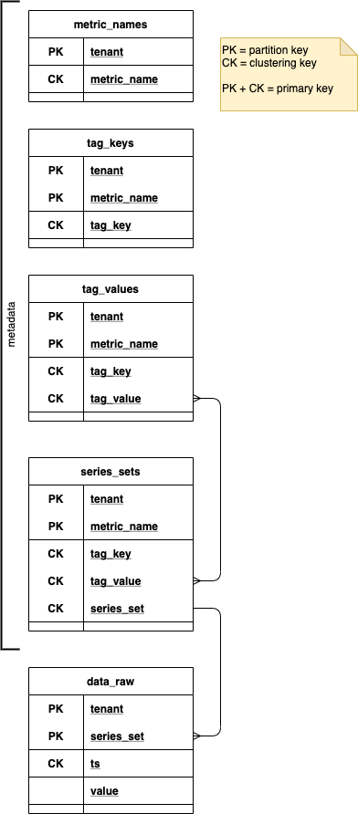

A simple multi-dimensional, time-series ingest and query service backed by Cassandra.

## Quickstart

Startup a Cassandra container:

```shell script
docker-compose up -d
```

Watch the container logs until it reports "Starting listening for CQL clients on /0.0.0.0:9042":
```shell script
docker-compose logs -f cassandra
```

Create the keyspace:
```shell script
docker-compose exec cassandra \
  cqlsh -e "CREATE KEYSPACE IF NOT EXISTS tsdb WITH replication = {'class': 'SimpleStrategy', 'replication_factor': 1}"
```

Start the ingest/query application:
```shell script
mvn spring-boot:run
```

### Write some data

```http request
POST http://localhost:8080/api/write/single
Content-Type: application/json

{
  "tenant": "t-1",
  "metricName": "cpu_idle",
  "tags": {
    "os": "linux",
    "host": "h-1",
    "deployment": "prod"
  },
  "ts": {{$timestamp}},
  "value": {{$randomInt}}
}
```

### Query metadata

Metric names, such as
```http request
GET http://localhost:8080/api/metadata/metricNames?tenant=t-1
```

Tag keys, such as
```http request
GET http://localhost:8080/api/metadata/tagKeys?tenant=t-1&metricName=cpu_idle
```

Tag values, such as
```http request
GET http://localhost:8080/api/metadata/tagValues?
  tenant=t-1
  &metricName=cpu_idle
  &tagKey=os
```

### Query data

```http request
GET http://localhost:8080/api/query?
  tenant=t-1
  &metricName=cpu_idle
  &tag=os=linux
  &start=2020-08-23T17:53:00Z
  &end=2020-08-23T17:54:40Z
```

Responds with query results per series-set, such as:
```json
[
  {
    "tenant": "t-1",
    "metricName": "cpu_idle",
    "tags": {
      "host": "h-1",
      "os": "linux",
      "deployment": "prod"
    },
    "values": {
      "2020-08-24T00:13:16Z": 491.0,
      "2020-08-24T00:13:20Z": 792.0,
      "2020-08-24T00:13:21Z": 824.0
    }
  },
  {
    "tenant": "t-1",
    "metricName": "cpu_idle",
    "tags": {
      "host": "h-3",
      "os": "linux",
      "deployment": "dev"
    },
    "values": {
      "2020-08-24T00:15:52Z": 84.0,
      "2020-08-24T00:15:55Z": 498.0
    }
  }
]
```

## Design

### Tables

The Cassandra tables in the `tsdb` keyspace (by default) are organized into two categories:
- **metadata** : tables that enable metadata lookup directly or to enable queries
- **data** : tables that store the timestamped values



To be a bit more explicit, all these tables are written to on ingest.  The "metric_names" table is only read by the "metricNames" metadata query; the "tag_keys" by the "tagKeys" metadata query and the "tag_values" by the "tagValues" metadata query.  The "series_set" and "data_raw" tables are only read by the "query" data query.

### Series-Set

Each series is identified by a "series-set" which is a compact, textual, stable representation of a series.

The syntax is:
```
{metric_name},{tag_key}={tag_value},{tag_key}={tag_value},...
```

where the tag key-value pairs are sorted by tag key to ensure a stable and deterministic structure.

The `series_sets` table is effectively an index of each `tag_key`-`tag_value` pair to the one or more series sets that contain that tag pair.

### Ingest

When ingesting a metric, the following actions occur:
1. A series-set is computed from the metric name and tags, [as described above](#series-set)
2. The data value itself is inserted
3. The metadata of the metric series is "upserted". 
   - Cassandra doesn't have first-class support for upserts; however, the metadata tables consist entirely of primary key columns and a CQL `INSERT` differs from SQL in that it will ensure "the row is created if none existed before, and updated otherwise"
   - Four tables are involved in the metadata upsert in order to accommodate the denormalized/NoSQL nature of Cassandra and enable metadata retrieval by each facet

### Data Query

The goal of a data query is to provide the data for the requested tenant, metric name, and one or more tags whose timestamped values fall within the requested time range

Such a query is performed in two steps:
- query the series_set table to retrieve the metadata for the requested tenant, metric name, and tags 
- use that metadata to query the data_raw table to retrieve the values that fall within the requested time range

The first step is achieved by retrieving the list of series-sets for each request tag (key-value). For example, let's say the query is requesting the metric `cpu_idle` and results for the tags `os=linux` and `deployment=prod`. A metadata retrieval of series-sets for each tag would be:

For `os=linux`:

| tenant | metric\_name | tag\_key | tag\_value | series\_set |
| :--- | :--- | :--- | :--- | :--- |
| t-1 | cpu\_idle | os | linux | cpu\_idle,deployment=dev,host=h-3,os=linux |
| t-1 | cpu\_idle | os | linux | cpu\_idle,deployment=prod,host=h-1,os=linux |
| t-1 | cpu\_idle | os | linux | cpu\_idle,deployment=prod,host=h-4,os=linux |

For `deployment=prod`:

| tenant | metric\_name | tag\_key | tag\_value | series\_set |
| :--- | :--- | :--- | :--- | :--- |
| t-1 | cpu\_idle | deployment | prod | cpu\_idle,deployment=prod,host=h-1,os=linux |
| t-1 | cpu\_idle | deployment | prod | cpu\_idle,deployment=prod,host=h-2,os=windows |
| t-1 | cpu\_idle | deployment | prod | cpu\_idle,deployment=prod,host=h-4,os=linux |

The series-sets to retrieve from the data table can then be computed by finding the intersection of `series_set` from all of the tag retrievals. With the example above, that intersection would be:

- `cpu_idle,deployment=prod,host=h-1,os=linux`
- `cpu_idle,deployment=prod,host=h-4,os=linux`

The second step of the query is achieved by iterating over each series-set and querying the data table by tenant, series-set, and the requested time-range. Continuing the example, those rows from `data_raw` would be:

| tenant | series\_set | ts | value |
| :--- | :--- | :--- | :--- |
| t-1 | cpu\_idle,deployment=prod,host=h-4,os=linux | 2020-08-24 16:34:05.000 | 477 |
| t-1 | cpu\_idle,deployment=prod,host=h-1,os=linux | 2020-08-24 15:51:15.000 | 186 |
| t-1 | cpu\_idle,deployment=prod,host=h-1,os=linux | 2020-08-24 16:23:54.000 | 828 |
| t-1 | cpu\_idle,deployment=prod,host=h-1,os=linux | 2020-08-24 16:23:58.000 | 842 |
| t-1 | cpu\_idle,deployment=prod,host=h-1,os=linux | 2020-08-24 16:26:52.000 | 832 |
| t-1 | cpu\_idle,deployment=prod,host=h-1,os=linux | 2020-08-24 16:34:05.000 | 436 |

The resulting JSON structure derives the metric name and tag-map by decomposing the series-sets of the results and combining each with the timestamp-values. For example:

```json
[
  {
    "tenant": "t-1",
    "metricName": "cpu_idle",
    "tags": {
      "host": "h-4",
      "os": "linux",
      "deployment": "prod"
    },
    "values": {
      "2020-08-24T16:34:05Z": 477.0
    }
  },
  {
    "tenant": "t-1",
    "metricName": "cpu_idle",
    "tags": {
      "host": "h-1",
      "os": "linux",
      "deployment": "prod"
    },
    "values": {
      "2020-08-24T15:51:15Z": 186.0,
      "2020-08-24T16:23:54Z": 828.0,
      "2020-08-24T16:23:58Z": 842.0,
      "2020-08-24T16:26:52Z": 832.0,
      "2020-08-24T16:34:05Z": 436.0
    }
  }
]
```

### Downsampling (a.k.a. roll-ups, normalized)

Downsampling is the process of aggregating "raw" metrics, which are collected and conveyed at arbitrary timestamps, into deterministic time granularities, such as 5 minute and 1 hour. The intention is to keep aggregated metrics for much longer periods of time than the raw metrics. Downsampling also benefits queries with wider time ranges since it reduces the number of data points to be retrieved and rendered. 

This process is also known as roll-up since it can be thought of finer grained data points rolling up into wider and wider grained levels of data. It is also referred to as normalized since the result of downsampling allows related metrics to be compared in time since the timestamps would align consistently even if those metrics were originally collected slightly "out of sync". 

- Downsampling work is sliced into partitions, much like Cassandra's partitioning key concept
- Partitions are an integer value in the range \[0, partition-count\)
- A particular partition value is computed by hashing the tenant and series-set of a metric and then applycing a consistent hash, such as [the one provided by Guava](https://guava.dev/releases/21.0/api/docs/com/google/common/hash/Hashing.html#consistentHash-com.google.common.hash.HashCode-int-)
- The application is configured with a "time slot width", which is used to define unit of tracking and the range queried for each downsample operation.
- As a raw metric is ingested, the downsampling time slot is computed by rounding down the metric's timestamp to the next lowest multiple of the time slot width
- The time slot width must be a common-multiple of the desired granularities. For example, if granularities of 5 minutes and 1 hour are used, then the time slot width must a multiple of an hour. With a one-hour time slot width, 12 5-minute downsamples would fit and one 1-hour downsample. 
- The following table is used to track pending downsample sets by "upserting" the corresponding row as part of raw metric ingestion

`pending_downsample_sets`:

Type | Column
-----|------------
PK   | partition
CK   | time_slot
CK   | tenant
CK   | series_set

- The `time_slot` is the first of clustering keys to ensure that oldest raw data is processed before newer raw data
- This application will be replicated/scaled-out in order to accommodate the workload of the series-set cardinality
- Each replica is configured with a distinct set of partition values that it will process
- On a periodic basis, each replica will query the `pending_downsample_sets` for each partition that it owns along with an upper bound on the `time_slot` to ensure that very recent metrics are allowed a certain amount of time to settle before being considered for downsampling
    - Each resulting row drives the raw data query to perform since it includes tenant, series-set, `time_slot` as the start of the time range and `time_slot` + slot width as end of time range
    - The following aggregations are performed for each downsample:
        - min
        - max
        - sum
        - count
        - average
    - The naming of aggregate metrics will append the aggregation to the existing name preceded by an underscore. For example, the aggregation of the metric `cpu_usage_idle` will production `cpu_usage_idle_min`, `cpu_usage_idle_max`, and so on
    - A raw metric with a name that already ends with an aggregate qualifier, will only be aggregated with the same aggregation with the exception of "average" (since an average of an average is not mathematically robust). For example, if a raw metric is named `cpu_usage_idle_min` then only a min-aggregation is performed
    - A configurable list of "counter suffixes" is used to further identify those raw metrics that should only be aggregated with a sum-aggregation. Examples of such suffixes are "reads", "writes", "bytes"
    - The downsample process will then iterate through the retrieve raw data values, which were supplied in time ascending order, and incrementally aggregate the values. [Commons Math's description statistics](https://commons.apache.org/proper/commons-math/userguide/stat.html#a1.2_Descriptive_statistics) or similar could be used to perform those per-granularity aggregations.
    - As each granularity interval of the raw data set is aggregated, an aggregated data row is upserted for that tenant, series-set, and normalized timestamp.
        - As mentioned above, Cassandra doesn't have an "upsert", but `UPDATE` effectively acts as one. 
        - It's important that the aggregate data row be `UPDATE`d rather than `INSERT`ed to accommodate late arrival handling, describe below
    - Upon completion of each `pending_downsample_sets` result row, that row is deleted from the table
- Late arrivals of metrics into `data_row` are an interesting case to confirm are covered by the strategy above. There are two versions of late arrivals:
    - No metrics at all showed up for a given tenant+series-set during a time slot. 
        - That case is handled by the design above simply because the `pending_downsample_sets` row never would have been created. 
        - When those metrics arrive later, the `pending_downsample_sets` row is created at that time and the downsample process will agreegate those as normal.
    - If a subset of metrics showed up for a given tenant+series-set during a time slot
        - The downsample processor won't know that there's a subset of the expected metrics; however, that's fine because all of the aggregations are mathematically correct for what is present. For example, the "count" aggregation would be accurate even if it's a lesser value than was expected by an end user
        - When the remaining metrics arrive later, the `pending_downsample_sets` row is **recreated**
        - The downsample processor will pick up on the pending row at the next scheduled time and *assuming the raw data for the time slot has not TTL'ed away*, the re-query of that time slot's raw data will now retrieve all expected metrics entries
        - The downsample processor will aggregate the granularities entries as described above and again upsert/UPDATE the resulting aggregated data rows. With the UPDATE the "partial" aggregation values will be replaced by the "complete" aggregation values
    
TBD
- Aggregated data table(s)
    - Should there be a table per downsample granularity, such as `data_5m`, `data_1h` and each of those tables have the same columns as `data_raw`? Downside is that the application will need to explicitly manage those table creations vs the Spring Data Cassandra driven schema management (so far)
    - Or...should there be one table for all downsample, such as `data_downsampled`, that includes an additional CK column conveying the downsample granularity, such as "5m", "1h". Downsample queries could then narrow by specifying that column's granularity in the WHERE-clause 
